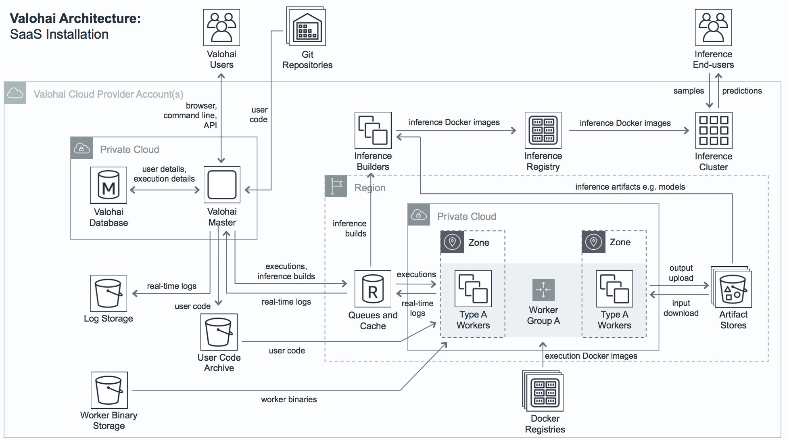

.. meta::
    :description: Valohai deep learning management platform architecture diagram and installation flavors.

Architecture
============

Valohai can be deployed in three flavors:

* **Software-as-a-Service (SaaS)**
  Users run workloads under Valohai owned AWS, Google Cloud, Azure and other cloud provider accounts.
  Valohai bills organization depending how much resources they use. SaaS flavor works without any setup.
* **Private Workers Installation:**
  The worker nodes that handle the data processing, training and inference are all deployed within
  customer-owned AWS, Google Cloud or Azure account.
  No input or output data necessarily ever leaves the customer account's perimeter.
* **Full Private Installation:**
  All components are deployed inside customer-owned AWS, Google or Azure cloud or a physical data center,
  allowing a fully self-contained installation. Required for setups without Internet connection.

Components
~~~~~~~~~~

To get a general idea of how the architecture looks, here is a diagram of the common SaaS use-case:

* **Valohai Master:**
  Valohai master node that runs the web application and the API.
  The master is the core component that manages all the other resources such as scheduling executions and
  managing individual worker groups' scale across cloud providers.
* **Valohai Database:**
  A relational database that contains user data and saves execution details such as which worker type was used,
  what commands were run, what Docker image was used, which inputs where used and what was the launch configuration.
* **Git Repositories:**
  External code repositories for the data science projects.
  Usually a private GitHub repository but can be any Git repository
  such as GitLab, BitBucket or GitHub Enterprise as long as the Valohai Master can access it.
* **User Code Archive:**
  We store Git commit snapshots in binary storage (AWS S3, Azure Blob Storage, etc.) to maintain reproducibility.
  Worker machines load the user code archives from this storage.
* **Worker Binary Storage:**
  Worker machines have an executable that downloads inputs (e.g. training data),
  starts the configured Docker image, reports real-time logs and uploads outputs (e.g. trained models).
  Worker release binaries and configuration scripts are stored in this binary storage.
* **Log Storage:**
  Real-time logs are moved to a binary storage for long-term storage after the target execution finishes.
* **Queues and Cache:**
  In-memory database instance that hosts execution/build queues and acts as temporary storage for
  user logs so they can be shown on the Valohai web app and API in real-time.
* **Workers Groups:**
  Workers are the servers that execute user code.
  There is one worker group per instance type (e.g. g2.2xlarge on AWS) per region (e.g. AWS Ireland).
  The Valohai Master manages these auto-scaling groups.
  Workers can also be a non-scaling cluster of on-premises machines.
  Worker groups can be backed by local hardware, AWS, Azure, GCP or OpenStack.
* **Artifact Stores:**
  Execution inputs are downloaded from and outputs are uploaded to a file storage.
  Valohai supports various storage backends but an AWS S3 bucket is the most commonly used artifact store.
* **Docker Registries:**
  The Docker images used are downloaded from a private or public Docker registry.
  Docker Hub is the most common one but you can also host a Docker registry inside your cloud provider account.
* **Inference Builders:**
  Before hosting your model for inference, we build a Docker image to make deployments fast and reliable.
  It will prebuild all files required for deployment so endpoint can be easily scaled.
* **Inference Registry:**
  The inference Docker images used are uploaded to a private Docker registry,
  usually hosted under the inference provider account like AWS, GCP or Azure.
* **Inference Cluster:**
  The Kubernetes cluster that hosts the inference request/response endpoints.
  It downloads the used images from private inference registry and exposes them for clients.
