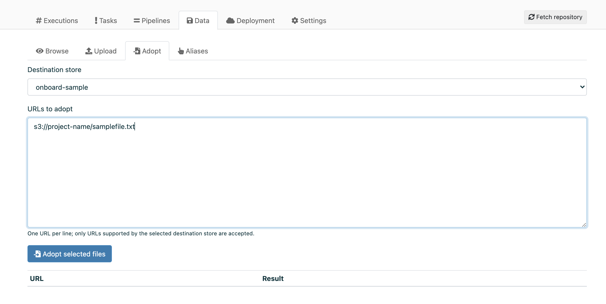

.. meta::
    :description: This how to guide shows you how to adopt storage URLs into Valohai-tracked datums.

.. _howto-alias-adoption:

Datum adoption
################################################

In general, only files that go through an execution or are uploaded into Valohai will get a datum URL. 
However, in some cases it might be beneficial to create datum URLs for existing files in your S3 storage
without needing to push them through Valohai separately. 

To do this, it is possible to adopt storage URLs into real, Valohai-tracked datums. This gives all the benefits
related to datum URLs, including traceability and setting aliases. 

.. attention::

    Currently, S3 is the only supported store for datum adoption.
    

Adopt storage URLs into datums
-----------------------------------

It is possible to adopt storage URLs into Valohai datums either in the web UI or by using the Valohai APIs.

In the Web UI
^^^^^^^^^^^^^^^

* Open your project on `app.valohai.com <https://app.valohai.com>`_
* Open the **Data** tab
* Open the **Adopt** tab
* Select the **Destination store** from the dropdown menu
* Add the URLs to adopt (one per line). Note that they have to be supported by the destination store. 
* Click **Adopt selected files**

By using API requests
^^^^^^^^^^^^^^^^^^^^^^^

* Generate yourself an API token as shown in :doc:`API Basics </tutorials/example-project/quick-start-api>`
* Send a POST request to ``https://app.valohai.com/api/v0/stores/{id}/adopt/``
* In the request body, send a JSON consisting of the URL to adopt and the project ID:

.. code-block:: JSON

    {
        "url":"s3://project-name/samplefile.txt",
        "project":"project ID"
    }

..

* You can get the project ID from under the **Settings** tab in the Valohai UI

.. seealso::

    * :ref:`howto-datum-alias`
    * :doc:`API Basics </tutorials/example-project/quick-start-api>`
    
