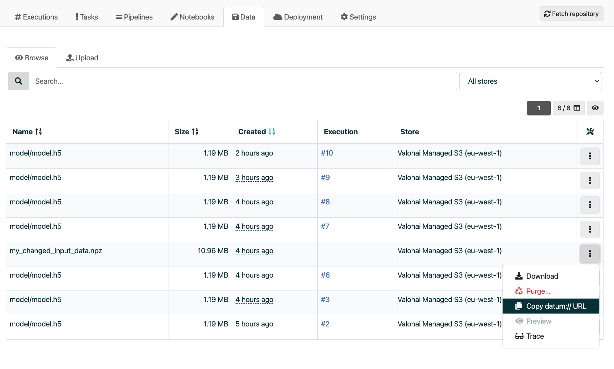

.. meta::
    :description: Upload data to Valohai

.. _howto-data-upload-files:

Upload data to Valohai
##########################

.. warning::

    Uploading files from the web app is designed for small files. Please check your cloud providers recommendation, if you're looking to upload large sets of data to your cloud storage. 

    * `Uploading objects to AWS S3 <https://docs.aws.amazon.com/AmazonS3/latest/userguide/upload-objects.html>`_
    * `Uploading objects to Google Cloud Storage <https://cloud.google.com/storage/docs/uploading-objects>`_
    * `Move data to Azure Blob storage <https://docs.microsoft.com/en-us/azure/storage/blobs/storage-blobs-introduction#move-data-to-blob-storage>`_

This guide shows you how to upload files to your cloud storage directly from the Valohai web app.

* Login to `app.valohai.com <https://app.valohai.com>`_ 
* Open your project
* Click on your Project's **Data** tab
* Click on the **Upload** tab
* Choose the right data store from the dropdown on the right side
* Select files from your local machine
* Click **Upload** 

Navigate back to the **Browse** tab when upload has completed. You should see your uploaded file on the top of the list.

Click on ``...`` at the end of the row to get the link to the data file.

.. tip::

    If you uploaded your file to a Valohai owned data store you'll see only a ``datum://`` link. Datum links are unique links that point to specific files in the Valohai platform.

    If you upload files to your own data store you'll also see a link that your cloud provider understands (e.g. ``s3://``, ``azure://``, or ``gs://``).

    You can use either link in your Valohai executions.

.. seealso::

    * :ref:`cloud-storage`
    * `Uploading files from executions </topic-guides/executions/outputs/>`_

