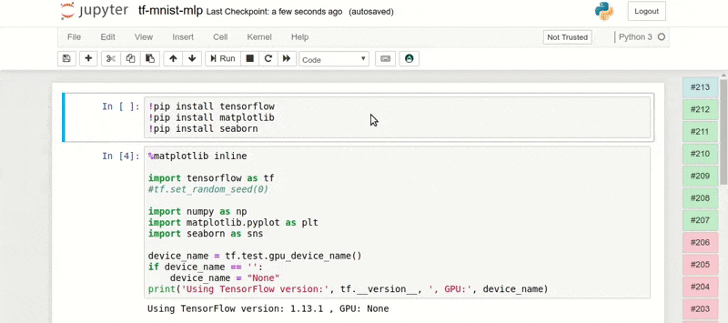

.. meta::
    :description: Valohai Jupyter notebook extension

Jupyter Notebook (beta)
=======================

Jupyhai is the Valohai Jupyter notebook extension. It enables you to use Jupyter notebooks easily with the Valohai platform.
It is an optional way of interacting with projects in the same capacity as our web user interface, API and CLI.

1. Requirements
~~~~~~~~~~~~~~~

To use jupyter notebook extension, you will need:

* Docker (https://docs.docker.com/install)

2. Installation
~~~~~~~~~~~~~~~

Pull the valohai/jupyhai docker image from DockerHub.

.. code-block:: bash

  docker pull valohai/jupyhai

3. Notebook server
~~~~~~~~~~~~~~~~~~

Run the notebook server in port 8888.

.. code-block:: none

  docker run -p 8888:8888 -v "$PWD":/home/jovyan/work valohai/jupyhai

Open in browser: http://127.0.0.1:8888

.. thumbnail:: token2.png
   :alt: Input token source
.. thumbnail:: token.png
   :alt: Input token

Copy the token from terminal to the login form.

Your current folder will be mapped into `/work` inside the server to move files between
the docker container and your local filesystem. This means anything saved in `/work` will persist
even if you shut down the container.

4. Create notebook
~~~~~~~~~~~~~~~~~~

.. thumbnail:: createnotebook.gif
   :alt: Creating new notebook

Create new notebook in the `/work` folder. This folder is mapped to your local filesystem.

5. Login
~~~~~~~~

.. thumbnail:: login.gif
   :alt: Login to Valohai

Press the Valohai button in the toolbar and login using your Valohai credentials.

6. Settings
~~~~~~~~~~~

.. thumbnail:: settings.gif
   :alt: Valohai execution settings

Press the Valohai button in the toolbar and go to settings window.

Select the following:

- **Project**: Valohai project where the executions will be version controlled
- **Environment**: Environment type for the cloud executions (E.g. AWS p2.xlarge)
- **Docker Image**: Docker image that provides the required libraries (E.g. Tensorflow)

These are the same settings you would choose when using Valohai website, CLI or `valohai.yaml`.

Once you are happy with your selections. Press save.

7. Create execution
~~~~~~~~~~~~~~~~~~~

.. thumbnail:: execution.gif
   :alt: Running Valohai execution

Press the Valohai button in the toolbar and select *Create execution*.

The gizmo for the new execution will appear to the right.

8. Get results
~~~~~~~~~~~~~~

.. thumbnail:: download.gif
   :alt: Get results back from Valohai

Each gizmo on the right side signifies a single Valohai execution. Click #1 and
then click `Notebook` button.

This will download the finished notebook back to your local machine and open it.

9. Parameterize notebook
~~~~~~~~~~~~~~~~~~~~~~~~

.. thumbnail:: parameterize.gif
   :alt: Adding hyperparameter

Parameterizing notebook happens using tags. Tags are Jupyter notebook feature that lets tag a cell.

Here we will mark the first cell with `parameters` tag, which means all variables are considered as Valohai parameters,
just like in the `valohai.yaml`.

10. Inputs
~~~~~~~~~~

.. thumbnail:: inputs.png
   :alt: Adding parameterized input

Here we marked the first cell with `inputs` tag and ran it in Valohai.

All the variables in this cell will be considered as Valohai input URIs for the execution, just like in the `valohai.yaml`.

11. Reusing parameterized notebook
~~~~~~~~~~~~~~~~~~~~~~~~~~~~~~~~~~

.. thumbnail:: parameter2.gif
   :alt: Adding hyperparameter

Now you can run notebook based experiments without a notebook!

Because the `learning_rate` here is parameterized, you can set it via Valohai UI and run experiments
without opening a visible notebook.

FAQ
~~~

**When I try to download my outputs back from finished execution, I get 404: Not Found**

Always use `http://127.0.0.1:8888` instead of `http://localhost:8888`
