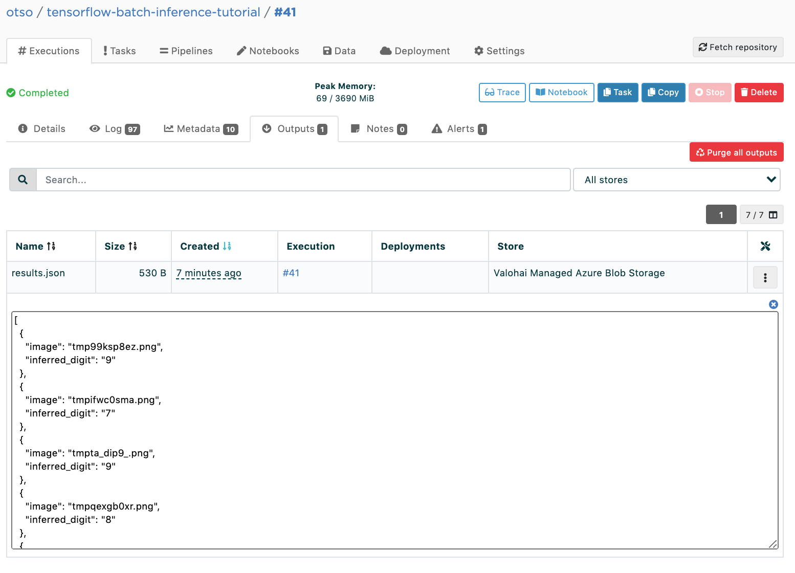

.. meta::
    :description: How to do Batch Inference with an image dataset

Batch Inference with Image Data
===============================

In this tutorial you will learn how to create and run a Batch Inference execution in Valohai. This execution will use TensorFlow 2.4.1 to run inference on ten unique images using a pre-trained MNIST model.

.. admonition:: Prerequirements
    :class: attention

    For this tutorial you will need:

    * Python 3.6 or newer
    * Valohai command-line client (Run ``pip install --upgrade valohai-cli``)

    We're also going to need two files:

    * an MNIST model trained with TensorFlow 2.4.1
    * some images to classify, packaged in a single zip file

    To make it easy for you they are available here, no need to download them:

    * Model: `<s3://valohai-public-files/tutorials/batch-inference/image-batch-inference/model.h5>`_
    * Images: `<s3://valohai-public-files/tutorials/batch-inference/image-batch-inference/images.zip>`_

    If you want to, you can train the required model by following our `Valohai 101 tutorial </tutorials/quickstart/>`_.

Running on Valohai
------------------

To easily run our batch inference on Valohai, we will use it to run our code from the very beginning.

If you don't already have a Valohai account, go to `<https://app.valohai.com/>`_ to create one for yourself.

Create a new folder for our project, then run the following commands in the project folder:

.. code-block:: bash

    vh login
    # fill in your username
    # and your password

    vh init
    # Answer the wizard questions like this:
    # "First, let's..." -> y
    # "Looks like..." -> python batch_inference.py, then y to confirm
    # "Choose a number or..." -> tensorflow/tensorflow:2.4.1, then y to confirm
    # "Write this to..." -> y
    # "Do you want to link..." -> C, then give a name for your project, then select your user

Edit the generated ``valohai.yaml`` so that it looks like this:

.. code-block:: yaml

    ---

    - step:
        name: Batch Inference
        image: tensorflow/tensorflow:2.4.1
        command:
        - pip install pillow valohai-utils
        - python batch_inference.py
        inputs:
        - name: model
          default: s3://valohai-public-files/tutorials/batch-inference/image-batch-inference/model.h5
        - name: images
          default: s3://valohai-public-files/tutorials/batch-inference/image-batch-inference/images.zip

What we are doing here is defining a single step for our machine learning pipeline, which is the Batch Inference step. We will run on top of the official ``tensorflow/tensorflow:2.4.1`` Docker image, first install the ``pillow`` and ``valohai-utils`` Python libraries and then run our batch inference code.

Let's test that everything is set up correctly by running on Valohai:

.. code-block:: bash

    vh exec run --adhoc "Batch Inference"

If everything went as planned, we should see our Valohai execution end after finding out that ``batch_inference.py`` is missing:

.. image:: batch-inference-tutorial-1.png
   :alt: Error, but success!

Unpacking the Images
--------------------

...actually the Valohai helper library (``valohai-utils``) unpacks the images automatically, so we can just fetch their location with ``vh.inputs('images').paths()``!

Loading and Using Our Model
---------------------------

Okey, let's get started by creating and opening up ``batch_inference.py`` in your favorite editor!

Add these imports to the beginning of the file:

.. code-block:: python

    import json
    import os

    import numpy as np
    from PIL import Image
    import tensorflow as tf
    import valohai as vh

We are using the ``valohai-utils`` library to make integration with Valohai straightforward.

Begin by loading our model:

.. code-block:: python

    model = tf.keras.models.load_model(vh.inputs('model').path())

Easy, huh? Let's define a function to load up an image and apply preprocessing.

As we are using the MNIST dataset, our preprocessing will:

- Convert our images to grayscale
- Resize the images to 28x28 pixels
- Normalize the image levels from 0–255 to 0.0–1.0

Let's go!

.. code-block:: python

    def load_image(image_path):
        image_name = os.path.basename(image_path)
        image = Image.open(image_path)
        image.load()

        image = image.resize((28, 28)).convert('L')
        image_data = np.array(image).reshape(1, 28, 28)
        image_data = image_data / 255.0

        return (image_name, image_data)

Then define a function to run inference on an image:

.. code-block:: python

    def run_inference(image):
        image_name, image_data = image
        prediction = np.argmax(model.predict(image_data))

        with vh.logger() as logger:
            logger.log('image', image_name)
            logger.log('inferred_digit', prediction)

        return {
            'image': image_name,
            'inferred_digit': str(prediction),
        }

Finally, let's run these functions for all the images. While we already log all the individual inference results in the inference function, let's also save the complete results in a single JSON file.

.. code-block:: python

    results = []
    for path in vh.inputs('images').paths():
        results.append(run_inference(load_image(path)))

    with open(vh.outputs().path('results.json'), 'w') as f:
        json.dump(results, f)

Let's run the batch inference on Valohai:

.. code-block:: bash

    vh exec run --adhoc "Batch Inference"

If everything went according to plan, you can now preview the results in the Outputs tab:

.. seealso ::

    * `Valohai CLI </tutorials/valohai-cli/>`_
    * `Using Docker Images </topic-guides/docker-images/>`_
    * `Attach tags and metadata to your files </howto/data/tag-files/>`_
    * `Valohai APIs </tutorials/apis/>`_
