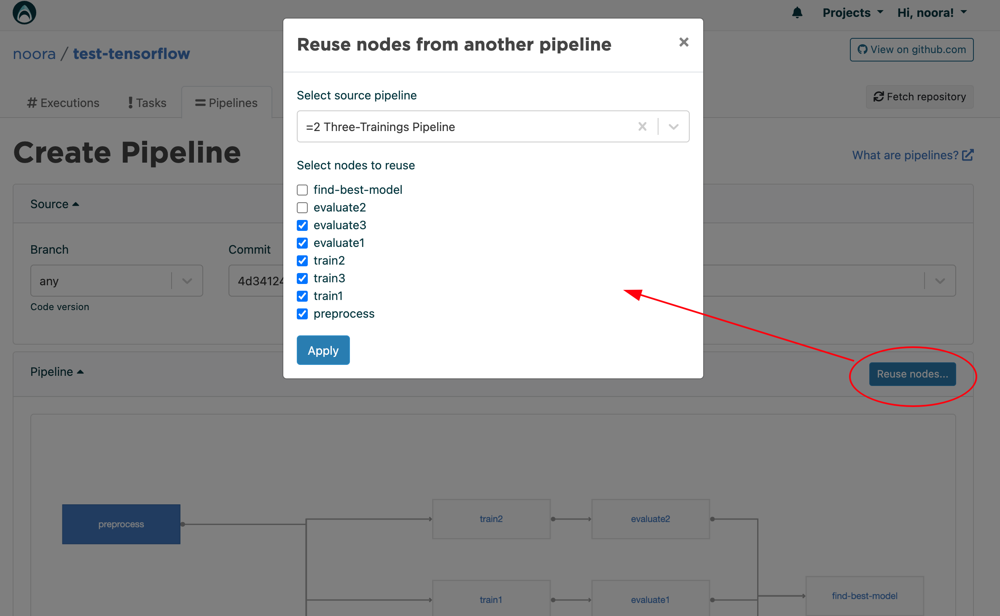

.. meta::
    :description: Create a Valohai training and deployment pipelines

.. _quickstart-pipeline:

Create a pipeline
#################

.. admonition:: Note
    :class: seealso

    This tutorial continues from where the :ref:`learning-paths-fundamentals` left off.
..

Pipelines automate your machine learning operations on Valohai ecosystem. A pipeline is a series of executions, Tasks and deployments.

.. admonition:: A short recap on pipelines
    :class: tip

    * A pipeline graphs consist of nodes and edges
    * You can launch pipelines manually, on a schedule or trigger them from your internal systems using the API
    * Read more about `pipelines </topic-guides/core-concepts/pipelines>`_

..

.. admonition:: Prerequirements
    :class: attention

    * :ref:`repository` before using pipelines

..

Define your pipeline in YAML
----------------------------

We'll continue from the previous part of this tutorial series by creating a pipeline that trains a new model and then publishes it as an endpoint.

Add a new definition for pipeline:

.. list-table::
   :widths: 10 90
   :stub-columns: 1

   * - ``nodes``
     - A node can be type of a execution, task or a deployment. It's a "single step" in the pipeline.
   * - ``edges``
     - Edges define how does data flow from one node to another. For example *move all files that start with "model" from train-node outputs, to deployment-node as the model file for the digits endpoint*

Create **two nodes:**
    * ``train-node`` will execute our ``train-model`` step
    * ``deploy-node`` will deploy our ``digits`` endpoint on an existing deployment called ``mydeployment`` (created in the previous tutorial).

Create **one edge** to connect the nodes:
    * ``model.h5`` from ``train-node``'s outputs will be passed as a file to the ``deploy-node``'s ``digits`` endpoint as the file ``model`` (that's defined in the endpoint).

.. code-block:: yaml
    :linenos:
    :emphasize-lines: 30,33,36,38,39,40

    - step:
      name: train-model
      image: tensorflow/tensorflow:2.4.1
      command:
        - pip install -r requirements.txt
        - python ./train.py {parameters}
      parameters:
        - name: epoch
          default: 5
          multiple-separator: ','
          optional: false
          type: integer
      inputs:
        - name: mnist
          default: s3://onboard-sample/tf-sample/mnist.npz
          optional: false

    - endpoint:
        name: digits
        description: predict digits from image inputs
        image: tiangolo/uvicorn-gunicorn-fastapi:python3.7
        server-command: uvicorn predict:app --host 0.0.0.0 --port 8000
        files:
            - name: model
              description: Model output file from TensorFlow
              path: model.h5

    - pipeline:
        name: Train and deploy
        nodes:
          - name: train-node
            type: execution
            step: train-model
          - name: deploy-node
            type: deployment
            deployment: mydeployment
            endpoints:
              - digits
        edges:
          - [train-node.output.model.h5, deploy-node.file.digits.model]

..

You can now push a new version of ``valohai.yaml`` to your code repository.

.. code-block:: bash

    git add valohai.yaml
    git commit -m "Added pipeline definition"
    git push

..

Launch a pipeline in Valohai
----------------------------

* Login to `app.valohai.com <https://app.valohai.com>`_
* Open your project
* Click on the **Fetch repository** button to fetch a new commit
* Click on your project's **Pipelines** tab
* Click on the **Create pipeline** button
* Select the **blueprint** from the dropdown menu
* You can click on either of the nodes to change their default settings
* Click on the **Create pipeline** button

The pipeline will start execution the train-model step and once it's done start a new deployment. When the deployment goes to ``100% Available`` the pipeline will be marked as completed.

Pipeline with multiple nodes
----------------------------

For an example with multiple nodes, please see our :ref:`example-projects-quick-start-tensorflow`. 

* It is worth noting that when evaluating multiple trained models inside a pipeline, **the comparison for choosing the best model is not done automatically**. 
* The user needs to define the comparison programatically in a separate node and then output the results to the possible next node (see the ``yaml`` file and ``compare.py`` in the example project).

Passing parameters in a pipeline
--------------------------------
In the previous example the edges between nodes were defined by the output of the first node and the deployment endpoint in the second node. Edges can be also used to pass parameters between nodes. 

.. code-block:: yaml
    :linenos:
    :emphasize-lines: 36, 37, 38, 39

    - step:
        name: Train model
        image: tensorflow/tensorflow:2.4.1
        command:
        - print "{parameters}"
        - python train.py {parameters}
        parameters:
        - name: user-id
          default: 345345
          multiple-separator: ','
          optional: false
          type: integer

    - step:
        name: Test model
        image: tensorflow/tensorflow:2.4.1
        command:
        - print "{parameters}"
        - python train.py {parameters}
        parameters:
        - name: user-id
          default: 3
          multiple-separator: ','
          optional: false
          type: integer

    - pipeline:
        name: Parameter to parameter
        nodes:
        - name: train-model
          step: Train model
          type: execution
        - name: test-model
          step: Test model
          type: execution
        edges:
        - [train-model.parameter.user-id, test-model.parameter.user-id]

..

If you want to pass a value created during the execution to the next node, you need to do this by passing it as metadata to a parameter:

.. code-block:: yaml
    :linenos:
    :emphasize-lines: 10,11,12,13

    - pipeline:
        name: Metadata to parameter
        nodes:
        - name: train-model
          step: Train model
          type: execution
        - name: test-model
          step: Test model
          type: execution
        edges:
        - [train-model.metadata.metadatakey, test-model.parameter.user-id]

Pipeline conditions
-------------------

In some cases you might want to terminate the pipeline if for example a metadata value exceeds some set limit. This can be done by using a pipeline property called ``actions``.
The structure for ``actions`` is: ``when`` something happens, check ``if`` the condition is true, and if yes, ``then`` stop the pipeline.

The possible options for ``when`` are:

* ``node-starting``
* ``node-complete``
* ``node-error``

The ``if`` condition can be based either on metadata or a parameter. Currently, the only available option for ``then`` is ``stop-pipeline``. 

.. code-block:: yaml
    :linenos:
    :emphasize-lines: 7,8,9,10

    - pipeline:
        name: Action pipeline
        nodes:
          - name: train-model
            type: execution
            step: Train model
            actions:
              - when: node-complete
                if: metadata.foo >= 0.8
                then: stop-pipeline
          - name: test-model
            type: execution
            step: Test model
        edges:
          - [train-model.output.model*, test-model.input.model]

..

Reusing nodes in a pipeline
---------------------------

In some cases it might happen that some nodes in a pipeline fail. To avoid having to run all the executions again, it is possible to reuse nodes from a previous pipeline run. 

* Start by creating a new pipeline by clicking on the **Create pipeline** button
* After choosing the pipeline blueprint, click on the **Reuse nodes...** button
* Select the source pipeline
* Select the nodes to reuse 
* Click on the **Apply** button
* You can change the default settings for the non-reused nodes by clicking on them.
* Click on the **Create pipeline** button

.. admonition:: Launch pipelines without YAML
    :class: tip

    You can also generate and launch a new pipeline directly with an API call, without having to define the YAML. The YAML definition is used only in the web app of Valohai, to visualize the pipeline and allow you to edit the default settings.

.. seealso::

    * `Core concepts: Pipelines </topic-guides/core-concepts/pipelines>`_
    * :ref:`pipeline-triggers`
